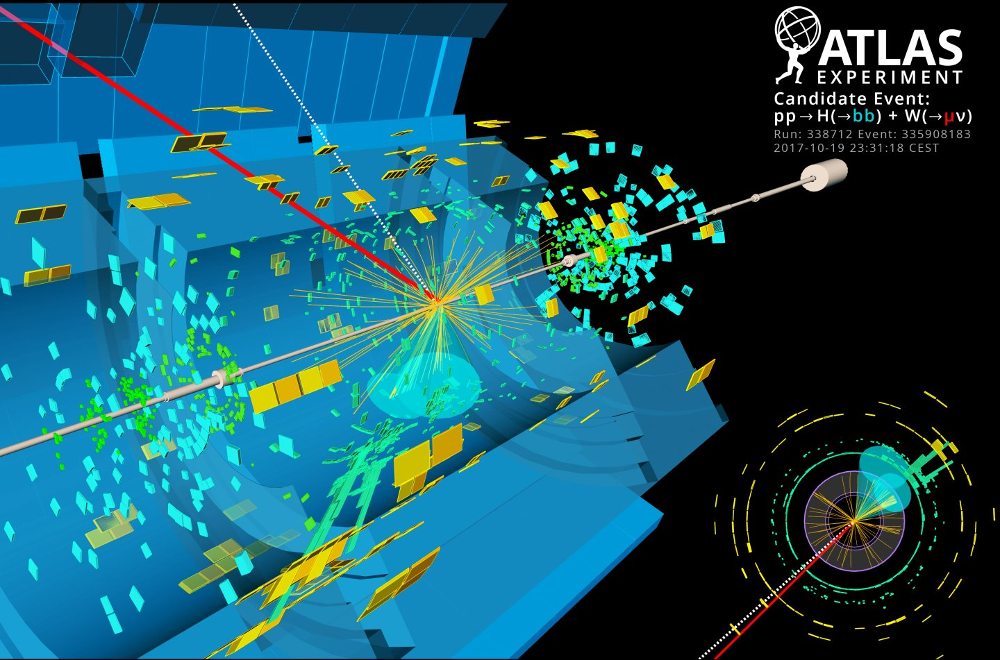

# CS-433 Project 1: Higgs boson detection

**This README should allow anyone to replicate our obtained results, for more detailed results,  interpretations, methodology see our report.**

## Introduction

In this project for the EPFL machine learning class, we will do exploratory data analysis to understand the dataset and its features, feature processing and engineering to clean the dataset and extract more meaningful information, implement and use machine learning methods on real data, analyze our model and generate predictions using  these methods and report our findings.



The dataset stems from one of the most popular machine learning challenges recently - finding the Higgs boson - using original data from CERN.

## Project structure

The project is structured as follows, if you want quick results, simple run `run.py`. To get an overview of our data analysis and machine learning pipeline, the notebooks  `data_analysis.ipynb` and `logistic_reg.ipynb` are ideal.

```
.
├── data                    # Location of the dataset (not provided, see next section)
│   ├── train.csv           # The training data set, with labels
│   └── test.csv            # The testing data set, no labels
├── predictions				# Folder with different submission files
│   └── submission.csv      # Our best submission (can be obtained by running run.py)
├── scripts                 # Source files
│   ├── implementations.py  # Our models methods and helper functions
│   ├── helper.py           # Methods to load and display data from labs and proj_1
│   ├── split.py            # Methods to split data set
│   ├── cross_validation.py # Methods allowing us to perform cross validation
│   └── run.py 				# Main script that runs entire pipeline, best submission
├── notebooks               # Our notebooks used for developement and testing
│   ├── least_squares.ipynb # Simple pipeline performing least squares regression
│   ├── logistic_reg.ipynb  # Simple pipeline performing logistic regression
│   └── data_analysis.ipynb # Data analysis and cleaning broken down
├── pictures                # Contains some pictures for this README and the report
├── LICENSE
└── README.md
```

> Important: All files and scripts are designed for Python 3.

## Data set

The data set can be downloaded [the official kaggle competition by CERN](https://www.kaggle.com/c/higgs-boson). From the description we see that the data is structured as follows: 

- **train.csv** - Training set of 250000 events. The file  starts with the ID column, then the label column, and finally 30 feature columns.
- **test.csv** -The test set of around 568238 events - Everything as for train.csv, except the label is missing.

Our task is to create the following file:

- **submission.csv** - A row should have label -1 if the features are predicted to be background noise, 1 if a higgs boson is detected.

We would like to point to [the technical documentation](http://higgsml.lal.in2p3.fr/documentation) from the LAL website on the task as well. 

**These are the details we were given about the data set at the beginning:**

- all variables are floating point, *except PRI_jet_num* which is integer
- variables prefixed with *PRI* (for *PRImitives*) are “raw” quantities about the bunch collision as measured by the detector.
- variables prefixed with *DER* (for *DERived*) are quantities computed from the primitive features, which were selected by the physicists of ATLAS.
- it can happen that for some entries some variables are meaningless  or cannot be computed; in this case, their value is −999.0, which is  outside the normal range of all variables.

## Our Approach

### Step 1: Implementation of basic ML Methods

We started by implementing basic machine learning functions that could be handy for the task in the implementations. The required functions were the following:

| Function                                                     | Details                                                      |
| ------------------------------------------------------------ | ------------------------------------------------------------ |
| least_squares_GD (y, tx, initial_w, max_iters, gamma)        | Linear regression using gradient descent                     |
| least_squares_SGD(y, tx, initial_w, max_iters, gamma)        | Linear regression using stochastic gradient descent          |
| least squares(y, tx)                                         | Least squares regression using normal equations              |
| ridge regression(y, tx, lambda )                             | Ridge regression using normal equations                      |
| logistic regression(y, tx, initial_w, max_iters, gamma)      | Logistic regression using gradient descent or SGD            |
| reg logistic regression(y, tx, lambda , initial_w, max iters, gamma) | Regularized logistic regression using gradient descent or SGD |

To implement most of these, helper functions are required. These are located in the same file (`implementations.py`) for simplicity, they are clearly labeled and put in a different section.

### Step 2: Additional ML Methods (Newton's Method)

We added a couple machine learning methods to perform (regularized) logistic regression with the Newton method. We didn't end up including the results in our report but we kept the methods in the `implementations.py` file.

### Step 3:  Exploratory data analysis

We performed multiple data analysis steps, like a five number summary, computing correlations, and more. These steps were useful to decide on data cleaning options. You can find all our conclusions in the commented notebook: `notebooks/data_analysis.ipynb`

> Note: All notebooks should be run from inside the /notebooks subdirectory, as otherwise the relative paths to the helper functions and dataset will be wrong.

### Step 4:  Data Cleaning

As we realized at Step 3 that the data can be split into 3 different datasets by the jet_num column, we had to adapt the provided methods that load the data and perform the predictions. To simplify the process, we grouped them in `split.py`. Some other methods for standardization for example are included in the `helpers.py` file as they were provided in the labs.

### Step 5: Testing Pipeline

At this point we wanted to get our first results and decided to experiment with different methods. In the end we decided to include the results of linear regression (least squares using normal equations) as well as logistic regression in the report. For this reason we provided the two basic pipelines (without cross validation) in the notebooks `least_squares.ipynb` and `logistic_reg.ipynb`. 

The pipeline is constructed in such a way that it can easily be changed to a different model. This is achieved by having two functions `transform_y()` and `transform_x()` that perform all operations on the dataset. In this way performing the same operations on a new dataset is a breeze.

> Note: All notebooks should be run from inside the /scripts subdirectory, as otherwise the relative paths to the helper functions and dataset will be wrong.

### Step 6: Feature expansion

We opted for the a simple feature expansion by expanding the features by a polynomial basis. We thus obtain polynomial regression as a special case of multiple linear regression. 

### Step 7: Cross-validation

In order to check for *under/- overfitting* of data, we needed to set up a test-bench using k-fold cross-validation. Our functions can be found in the `cross_validation.py` file. Note that we can simply pass a function as a parameter, and the cross validation method will yield the mean, max and min test error.

In most of our tests, we arbitrarily chose the k_fold parameter to be 5, since we read that it was a good standard, as it splits the data set into 80% train set and 20% test set.

### Step 8: Creation of Plots, hyper-parameter selection

We used the previously set up functionality to run many iterations of our methods with different hyper parameters. We created graphs used in the report along the way. For readability reasons, these scripts are not included in the submitted code.

### Step 9: Creation of run.py

Finally we took our code from our testing pipelines and exported it to the `run.py` script. If you want to replicate our results you can simply download the data set into the /data folder and run this script from inside the subdirectory as follows:

```bash
$ python3 run.py
```

A file named `submission.csv` will be created containing our methods predictions on the test set.

Note that we observed that different architectures (32bit/64bit) yield slightly different results. We believe that this is normal given the many floating point operations we do.

## Team members

- Benno Schneeberger
- Tiago Kieliger
- Yann Vonlanthen

## Further ideas

- [ ] Limit influence of outliers by using better techniques than just standardization.
- [ ] Use more carefully engineered features.
- [ ] Implement a better test bench for hyper parameter selection.
- [ ] Fine tune the convergence of stochastic logistic regression better.

